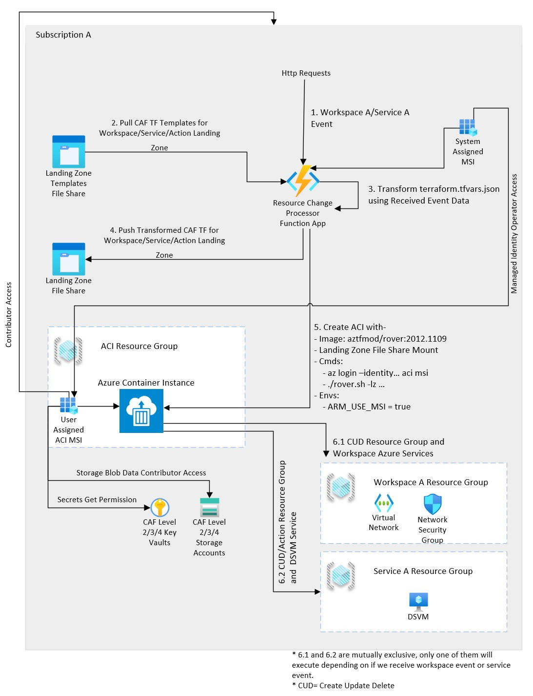

# Dynamic CAF Execution Engine
<Add Azure Deployment Button>
This repo demonstrates how Terraform CAF landing zones can be deployed dynamically from an API. This is an extensible design to allow development of new landing zones and amendment of existing ones by the a non-developer audience e.g. infrastructure engineers.

It covers the following design aspects-
1. Hosting of CAF landing zones to deploy resources.
2. Execution of CAF engine (Rover) on an on-demand basis.
3. Dynamic parameters replacement in CAF landing zones.

## How To
You will need to be familiar with CAF basics to be able to deploy and full appreciate this solution, please find more info around getting started with general CAF landing zones [here](https://github.com/Azure/caf-terraform-landingzones/blob/master/documentation/getting_started/getting_started.md)
Once you know the basics, follow the steps mentioned here-
1. Clone this repository locally.
2. Open VSCode in /infrastructure folder.
3. In VSCode reopen the folder in container (dev container).
4. Go to temrinal window in VSCode and run the landing zones as below-
   1. rover -lz /tf/caf/caf_landingzones/caf_launchpad -launchpad -var-folder /tf/caf/caf_landingzones/caf_launchpad/scenario/basic -a apply
   2. rover -lz /tf/caf/caf_landingzones/caf_foundations -level level1 -a apply
   3. rover -lz /tf/caf/caf_landingzones/caf_network_hub -level level2 -var-folder /tf/caf/caf_landingzones/caf_network_hub/scenario/single-region-hub-001 -a apply
   4. rover -lz /tf/caf/caf_landingzones/caf_core/scenario/dev-001 -level level3 -var-folder /tf/caf/caf_landingzones/caf_core/scenario/dev-001 -a apply
5. Solution is now deployed in your subscription.
6. Use http requests in HttpRequests folder to deploy landing zones for workspace, followed by service and actions on service.

## Design Thinking

To deploy a landing zone for any project we generally need to deploy various Azure services. As an example here, we have a workspace landing zone (level 3) and service landing zone (level 4). Workspace landing zone consist of a virtual network where data science VMs will be hosted. Service landing zone on the other hand consists of a VM with associated Azure services like network interface card, key vault etc.

Deployment of these landing zones is performed via Terraform configurations. These configurations are pre-created and stored in the form of templates i.e. they can be parameterised when new requests come for either workspace or a service landing zone. In this example we have three such landing zone templates, one for workspace, one for DSVM service and one for actions on a service.

The solution uses the CAF framework to deploy Terraform templates by the means of landing zones concept in CAF. CAF suggests deploying your infrastructure at different levels (0-4), **like the ISO OSI networking model** each level provides a foundation and services for the levels above it.

In CAF's context-

Level 4 deploys the actual end user application, in our case, a data science VM service is deployed at this level.
Level 3 deploys hosting infrastructure for the actual applications, in our case, a workspace is deployed at this level. We also deploy core application at this level which dynamically create workspaces and services.
Level 2 deploys core networking infrastructure like hub network in Hub-Spoke networking model to host shared services, in our case, we don't currently deploy hub network.
Level 1 deploys foundation services like diagnostics (Azure Monitor) which are reused by all the levels above it.
level 0 deploys a basic infrastructure to bootstrap Terraform e.g. creating backend state store and key vaults for every level.

It is important to note that we can and we do deploy multiple landing zones at different levels. A landing zone is an instance of template deployment of a specific type e.g. workspace template. This is specifically a case with workspaces and data science service i.e. for every new request for a workspace we deploy a new landing zone at level 3 and similarly for each new data science service request we deploy a new level 4 landing zone.

So how are these templates for workspace and data science service deployed?
CAF provides a landing zone deployment tool called [Rover](https://github.com/aztfmod/rover) which is hosted in a container and available from [container public registry](https://github.com/aztfmod/rover). The tool itself is a shell script to deploy Terraform with some CAF concepts baked into it. To deploy a template implementing a landing zone concept we run Rover container in Azure Container Instance (ACI) service on an on-demand basis.

The terraform template variable files terraform.tfvars.json for each landing zone template (i.e. workspace or service) are tokenised using Liquid templates, we use an [OSS nuget package](https://github.com/dotliquid/dotliquid) in RCP function to achieve this. Values from events received are replaced in this this template using Liquid template expression language. This allows us to update the Terraform landing zone template in the corresponding terraform.tfvars.json dynamically without changing code.

**Design Benefits**
1. It allows us to follow the CAF best practices for workspace and service deployments e.g. separation of concern and security at each layer.
2. To develop a new service or workspace, user does not need to change code, it can all be done via CAF TF templates

**Technologies**
The solution uses the following technologies-

Azure Container Instances- for hosting CAF rover tool and deploying landing zones.
Azure Function Apps - for running CAF landing zones.
Azure Service Bus - for dynamic message routing.
Azure Storage File Shares - for storing Terraform landing zone templates and transformed terraform.
Azure Managed Service Identity - for providing access to various azure services.
Cloud Adoption Framework - for deploying infrastructure.
Terraform - for deploying the core DMI application, workspace and service.
Liquid Templates - for transforming the Terraform json tfvar files using parameters in received event.

Glossary
- TF - Terraform
- CAF- Cloud Adoption Framework
- ACI- Azure Container Instance
- ASB- Azure Service Bus
- RCP- Resource Change Processor

I am greateful to [Laurent](https://github.com/LaurentLesle) for his support on CAF design which was extremely useful during the development of this solution. Also, [Joni](https://github.com/jjcollinge) for adding output to return the result from CAF deployment to the caller.
